The## Protecting the Vulnerable as a Policy with a Plan

#### Initial Summary

As the states and cities of the United States consider reducing the stringency of shelter-in-place orders and social distancing guidelines, we face the most difficult policy choices. Cases and deaths rising is a simple epidemiological fact during this period. Enabling more economic activity with a return to jobs and schools for many people, while attempting to limit deaths and possibly  infection rates, are necessary and inevitable goals. Confusing guidelines and potentially insuperable implementation challenges make achieving both goals simultaneously difficult. The two quasi-options on the plate in all of the varying jurisdictions around the country, and one new proposal, are: 

1. The economy or people’s economic well-being (by no means the same) is more important than a disease whose dangers are over-rated.
2. The policy of test, trace and isolate provides protection from increased infection rates and increased deaths that will permit those who do not test positive to return to work and to many typical activities with lighter restrictions.
3. Protecting the vulnerable with lighter restrictions for those *who do not serve the vulnerable* is a new policy option that we will show enables lighter restrictions, low death rates, and high infection rates.  This is not what Sweden actually did.

Number 1 is not an option even if it is the preference of some governments. A second rise in disease and deaths is a certainty and leads to outcomes very close to what would have occurred with never having any social distancing at all. That number of deaths is not over-rated. Number 2 must work theoretically and actually, if it could be implemented. Administrative challenges, the very large number of people infected at this stage of the epidemic and lack of social cooperation render it nearly impossible to achieve at the high thresholds of compliance required for it to effectively manage deaths. Number 3 sounds like Sweden. Sweden never intended for its high death rate outcome, but they did not understand this epidemic any more than any other country did and they did not have a plan to meet it. Number 3 provides a credible social contract, enlists compliance among the willing, and focuses protective resources on the segment of the population who will do nearly all the dying. 

#### Epidemic Response to “Opening Up”

Here we show the “double bump” of opening up that slightly delays results that will be almost as bad as if social distancing never happened. Epidemic scale infections are not over. At the same time, extension of strict social distancing that *might* reduce infections and deaths is, at this point, economically, politically and socially unsustainable.  

Here are 180 day simulations of a small city, Bismarck, ND, and a very large city, New York. Both are shown with no social distancing or isolation—as a base case. Nothing like this has happened or will happen: this is Covid-19 running completely unchecked.

Bismarck: unchecked virus        |  New York: unchecked virus
:-------------------------------:|:----------------------------------:
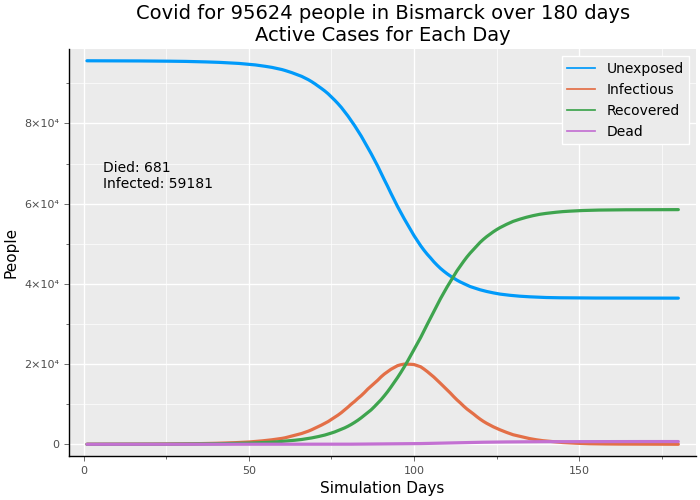|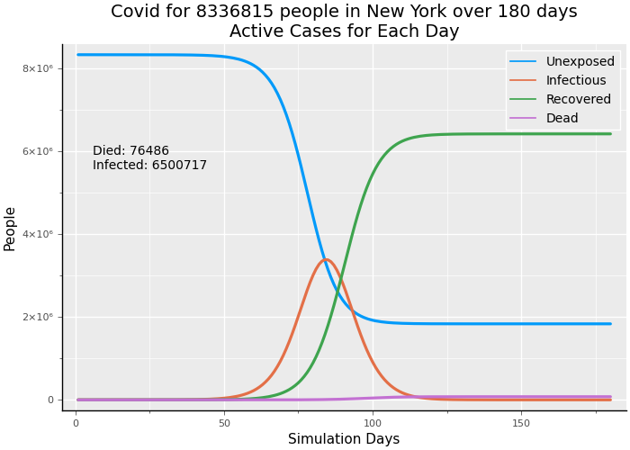

**Fig. 1: No social distancing or isolation**

We now show fairly strong social distancing starting on day 50.  This would be late March in NYC and perhaps early April in Bismarck. These death counts are larger than observed because the simulation runs for 180 days and data has been reported in the Johns Hopkins Covid dashboard for 122 days as of May 23, 2020. The simulation also has no uncounted cases or uncounted deaths, which certainly occurs in reality.

Bismarck: social distancing        |  New York: social distancing
:-------------------------------:|:----------------------------------:
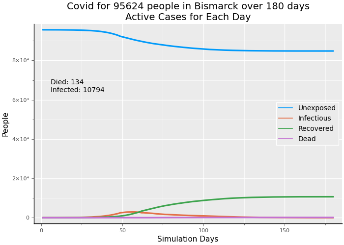|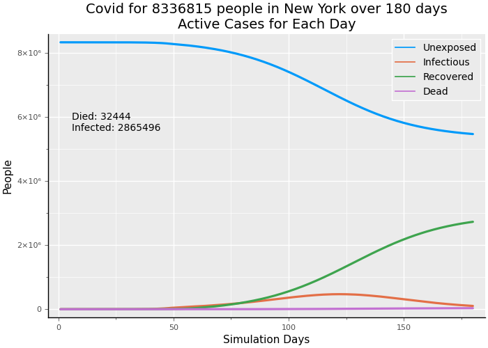 

**Fig. 2: Strong social distancing begins day 50**

Under economic, political and social pressure and with evidence that social distancing compliance by most people has flattened the curve, both locales may loosen social distancing—opening up under different protocols, but not to the freedom existing before the epidemic.  The number of cases (there are no unreported cases in the simulation) and deaths grows to be very close to the scenario with no social distancing. The virus spreads until there are no more susceptible people who can become infected. This hasn’t happened and it would be dreadful to allow it to happen.

Bismarck: opening up        |  New York: opening up
:-------------------------------:|:----------------------------------:
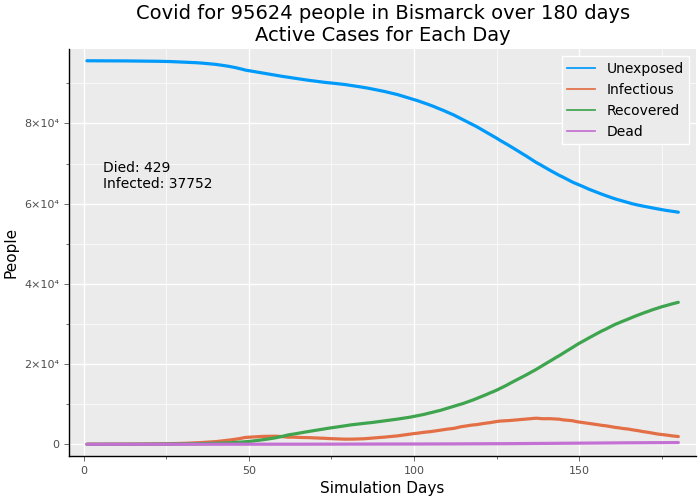|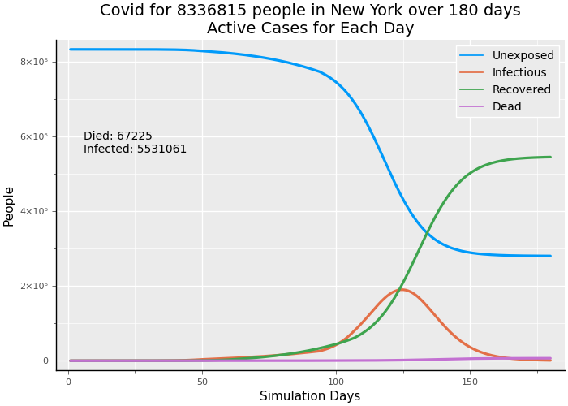 
**Fig. 3: Opening up with some social distancing still in place**

Removing the top plot line for the unexposed population, a much larger number than the other lines, makes it particularly clear what is happening in Bismarck. Bismarck is small enough that the active cases of infection had begun to decline. Opening up restarted the path to exponential growth in a "double bump." You don't see the bump in New York because the growth of active cases had slowed considerably, but had not been going down.  Instead of a "double bump", we see a slow down and then a new take-off. Note that neither city is following the policies in these scenarios.  New York is taking a more cautious approach to allowing more daily activity.

Bismarck: "Double Bump"       |  New York: "resumed take-off"
:-------------------------------:|:----------------------------------:
|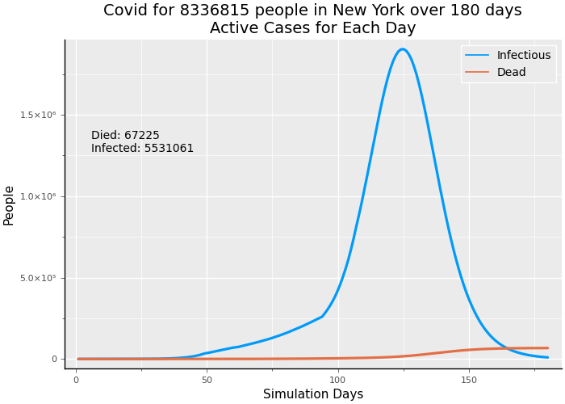 

**Fig. 4: Focus on infections and deaths after opening up**

To varying extents what the simulation depicts must happen in every locale. No locale has enough recovered people to provide the decline in cases that is called herd immunity. This is not just math in the simulation. Within 2 to 5 weeks after “opening up” real cities are seeing the double bump.  Governor Asa Hutchinson of Arkansas announced that his state was seeing a double bump on May 23, 2020.

The resulting increase in deaths will probably be considered intolerable in every moderately sized urban area (say with population in excess of 100,000) where population density is sufficient to fuel exponential growth. While the economic pressure is real and people need to work rather than seek relief, some approach must be found to enable resuming more activities without a dramatic increase in deaths.

#### Test, Trace and Isolate

Here we show the favorable impact of test, trace and isolate (“test and trace” from now on) when implemented with very high rigor. We then show what happens as rigorous thresholds of implentation and compliance are not met. Briefly, test and trace focuses on testing healthy people who are active to identify people who may be spreading the virus, rather than primarily testing sick people to confirm the presence of the Coronavirus. People who test positive are interviewed to determine their recent contacts. Those who test positive enter a 14 day quarantine. Their contacts may be requested to come in for a test or, in some jurisdictions, the contact is requested to also immediately quarantine. The concept is simple: identify as many people as possible who test positive; focus on contacts because some of them are likely to test positive; quarantine those who tested positive while allowing other people to begin resuming some normal activities.

Shown below is the most effective test and trace scenario. In both cities, 10% of the population can be tested per day; 95% of those requested enter quarantine, test results come back the same day, and 20% still breakout of quarantine early.  The  odd shape of the blue unexposed line is caused by false positives. Uninfected people exceed infected by a large margin. With a false positive testing rate of 10% (90% specificity) of more than 80% of all people and a true positive rate of 90% (90% sensitivity) of fewer than 10% of the people there are actually more false positives than true positives—so uninfected people are quarantined and then come out of quarantine with the bizarre result that unexposed people in circulation goes up, when it should only be possible to stay the same or go down. This seems a waste of testing resources, but at first glance there is no visible difference between an uninfected person and an asymptomatic, infected person.

Bismarck: Near maximum test and trace        |  New York: Near maximum test and trace
:-------------------------------:|:----------------------------------:
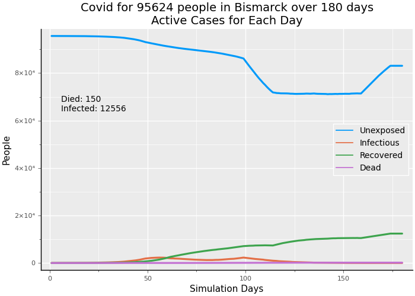|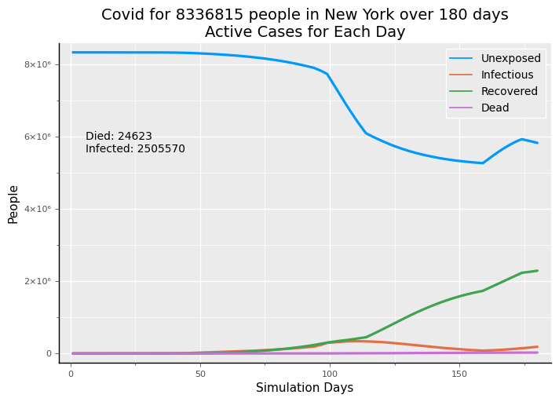 
**Fig. 5: Test and trace with daily test capacity = 10% of population; 95% quarantine compliance; same day test results; 20% breakout of quarantine early**

In the second scenario, both cities are able to test 5% of their populations per day; 95% of those requested do enter quarantine, test results are returned the same day, and 20% of those quarantined "breakout" before 14 days. 

Bismarck: mid-level test and trace        |  New York: mid-level test and trace
:-------------------------------:|:----------------------------------:
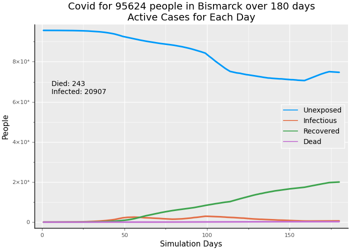|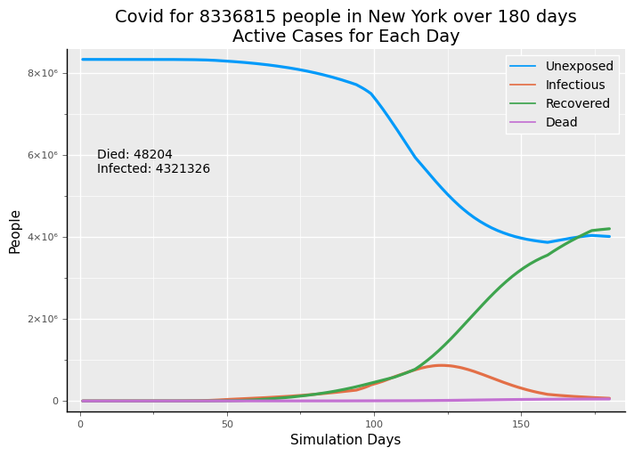 

**Fig. 6: Test and trace with daily test capacity = 5% of population; 95% quarantine compliance; same day test results; 20% breakout of quarantine early**

In this final scenario, Bismarck and New York are only able to test 1% of their population per day; test results take 3 days to come back; only 75% of those tested positive comply with the quarantine request, and 20% of people who go into quarantine "breakout" before 14 days are over. You see that the outcomes for infections and deaths are little better than "opening up."

Bismarck: minimal test and trace        |  New York: minimal test and trace
:-------------------------------:|:----------------------------------:
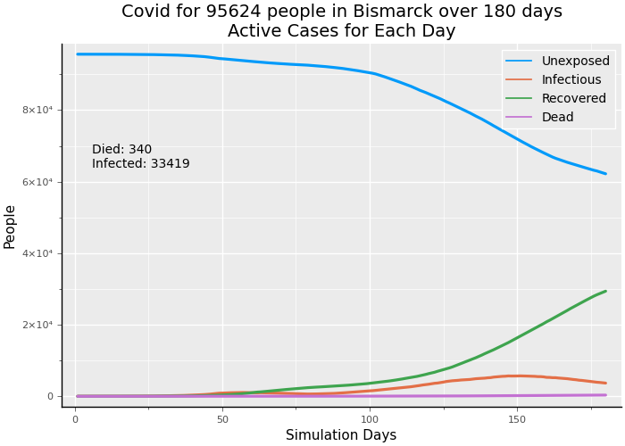|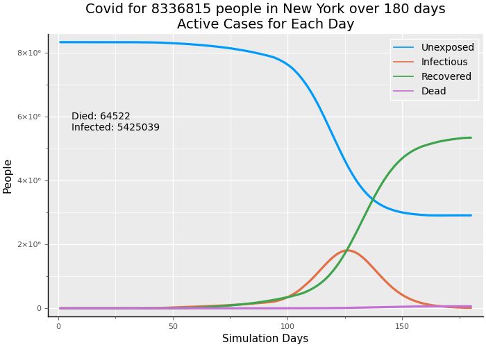 
**Fig. 6: Test and trace with daily test capacity = 1% of population; 75% quarantine compliance; test results in 3 days; 20% breakout of quarantine early**

High testing capacity, fast results, and high compliance really keep infections and deaths low *after* opening up. Removing people from circulation who are infectious must work. But, we believe that such high thresholds for implementing test and trace are unattainable in most locales (see Discussion, below). With lower attainment, the probable outcomes of infections and deaths will be only slightly better than continuing reduced social distancing restrictions, while causing high public health burdens and high social frustration, which will lead to additional non-compliance.

#### Protect the Vulnerable

We still need a plan for opening up to more economic activity and preventing very large increases in deaths. Here we show the impact of shifting the broad public health goal from preventing infection to preventing death. We outline steps of a practicable plan to achieve the prevention of deaths among the vulnerable while allowing the many, much less vulnerable people to return to many, but not all activities, with only moderate social distancing restrictions.

This scenario starts with stringent social distancing in New York, on the left. On the right, the restrictions are reduced without a full opening. Lifting the tight restrictions results in the expected bad outcomes in infections and deaths.

New York: Strong social distancing        |  New York: opening up
:-------------------------------:|:----------------------------------:
  |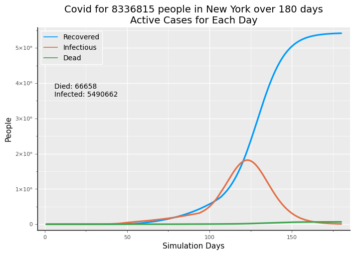 
 **Fig. 7: Compare New York with strong social distancing through the end of simulation with opening up**

Protect the vulnerable combines two policy actions: lifting social distancing restrictions considerably but not totally with isolating 70% of people over 80 years old and 50% of of people between 60 and 80. This approach is also susceptible to compliance challenges. Are all of those who serve or visit the vulnerable rigorously tested? What percentage of false negatives are there in the testing?  Further modeling will be needed to represent these challenges. For an initial approximation, we chose comparatively low isolation percentages instead. These results show that deaths are less than half the no social distancing at all case and are also much lower than relaxing social distancing with liberal opening up. Further, deaths are only 35 to 40% higher than sustaining stringent social distancing for 4 months (until the end of the 180 day simulation period), which is already ending to varying degrees across cities and states. Deaths are much lower than test and trace with 1%  testing capacity and significantly lower than test and trace with 5% testing capacity and high compliance. Only 10% capacity test and trace shows better results. It seems unlikely that New York can conduct over 880,000 tests per day.

|New York: Protect the vulnerable|
|:-------------------------------:|
|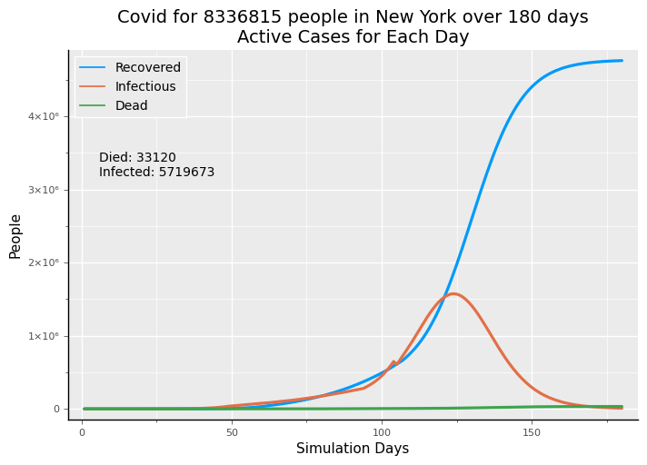|

**Fig. 8: Opening up with Protect the vulnerable isolating 70% of people over 80, 50% of people between 60-80**

Assuming an average caseload of 150 vulnerable people per *month* for each category of service provider described in the plan we calculate that in New York 3305 tests per day would be needed to provide 2 tests per week for each worker or just shy of 12400 tests per day to provide *daily* tests to each worker. We have not accounted for providing backup workers for those who test positive and must withdraw from serving the vulnerable. Some tests would still be done in hospitals and clinics for those being treated and for frontline medical providers. This number of tests is considerably lower than even the 1% threshold for test and trace, with dramatically lower deaths.  More work is needed to examine more modeling outcomes and estimating costs and compliance across both test and trace and protect the vulnerable. This first approximation suggests that protect the vulnerable is more promising and more feasible than test and trace at this stage of the Covid-19 epidemic in the United States.

Here is a summary of the results for deaths and infections from all of the cases shown in the graphs:

|                          | Bismarck        | New York              |
| ------------------------ | :-------------: | :-------------------: |
| Unchecked virus          | 681 59,181 | 76,486 6,500,717 |
| Strong social distancing | 134 10,794 | 32,444 2,885,496 |
| Opening up (partial)     | 429 37,752 | 67,225 5,531,061 |
| Maximum test and trace   | 150 12,556 | 24,623 2,505,570 |
| Mid-level test and trace | 243 20,907 | 48,204 4,321,326 |
| Minimal test and trace   | 340 33,419 | 64522 5,425,039  |
| Protect the vulnerable   |                 | 33,120 5,719,673 |

#### A Potential Plan

Test and trace has requirements that are very difficult to meet. The plan to protect the vulnerable also has challenging requirements that must be met:

1. All testing capacity must be devoted to people who provide medical care, to people who provide services to the vulnerable, and to people who are being treated for Covid. This is nearly the opposite of test and trace, in which you *want* to test asymptomatic people who could be spreading the virus rather than testing those who are obviously (?) sick. Instead, we segregate the vulnerable and test anyone who interacts with the vulnerable. We don’t try to test someone who is very, very unlikely to die and put everything into preventing infected people from any contact with people who are the mostly like to die (but, still not *that* likely).
2. This is a range of services that should be provided to the vulnerable by people who are frequently tested and repeatedly test negative:
   1. Medical care, especially including important non-Covid medical care that causes risk by being postponed.
   2. Personal care such as haircuts, manicures, and dental care that should be mobile and provided at home and in assisted living facilities and nursing homes.
   3. Reinforce the workforce and raise the minimum wages of all people who work in assisted living, extended care, and nursing homes. The low standards of service that were apparently provided in many facilties must be upgraded.
   4. Food delivery and food preparation for the vulnerable. Subsidized or completely free delivery should be available and easily obtained. 
   5. Prescriptions, retail medicine, and personal care products delivery.
   6. Ordinary household and personal products delivery but with tested personnel including clothes, books, and other small items. The activity coaches in the next point can act as concierges to help people unaccustomed to ecommerce in placing these orders.
3. As the period of the epidemic is extended until vaccines are widely available and administered or until “herd immunity” dramatically reduces new infections, mental health becomes more and more important—especially among a group that may already feel isolated from family and friends. We recommend a social coaching corps to provide such services as:
   1. Be “Zoom” concierges to help the non-technical (or those without access to any suitable devices) be in touch with friends, loved ones, and family at least twice a month but ideally once a week.
   2. Activity coaches who arrange and manage socially distant conversations (ok, maybe with yelling) and small group activities and help arrange the other services.
   3. Existing facilities in theory may have such people, but the elderly who live indecently or in multi-generational homes will also need these services.
4. Public funding should be provided for many of the people who do these jobs. Depending on the employer, the funding could be partial or complete. Philanthropic funding should also be sought.
5. Care must be exercised to prevent profiteering and fraud in providing these services. Rather than an elaborate new bureaucracy, existing local social welfare agencies, ngo’s and family member volunteers whose loved ones require these services should be enlisted to be the watchdogs over delivery of these services. 
6. All of these services are more valuable and beneficial to people than an army of contact tracers manning the phone lines to a largely uncooperative populace. The people and resources that might be applied to contact tracing are better applied to directly serving the vulnerable.

#### Discussion

The concern with reliance on test and trace is not that it can’t work.  It clearly can; it was the very first technique of mitigating consequences of epidemics and has grown more sophisticated with the application of medical and information technology. 

But, Covid-19 presents a serious challenge to test and trace:

- Close to 80% of Covid infections are asymptotic or mild so tests are required to determine disease status. Even in our late stage of the epidemic (or maybe it’s the middle), uninfected people are in the majority so there will be many false positives and many of the people asked to quarantine will be non-infectious.
- Transmission of the disease can occur for 5 to 12 days or more during the course of an infected person’s (mild) illness. When someone who tests positive is quarantined, that person might be at day 9 of the disease or day 2 (this is essentially impossible to know). In both cases, the requested quarantine will be 14 days. If a person “breaks out” of quarantine early—simply a matter of leaving the house—then either someone who is actually well does no harm, but someone who is still infectious resumes spreading the disease.
- These two factors require very high testing capacity.  Even capacity to test around 5% of the population *daily* is insufficient to reduce deaths below the level of perpetutating stringent social distancing, with the latter clearly no longer possible. People will need to be tested multiple times, further challenging test capacity. If we test contacts of those who tested positive, then we need even more tests. In some jurisdictions, contacts of anyone who did test positive are *requested* to quarantine even though the contact receives no test. This policy (not used everywhere) can only reduce voluntary compliance with quarantine “requests.”
- Quarantine compliance is questionable in the US because quarantine means shelter with co-resident partners or family.  The other members of the household have a high probability of becoming infected and spreading the disease. The US will not adopt South Korea’s approach of quarantining in publicly maintained facilities, with no departure until testing negative and no visitors. Nor will the US adopt China’s police enforcement of quarantines. We did not model “leakage” from quarantine, though we did model early breakout.  Leakage would worsen the outcomes shown.
- The three factors that worsen the effectiveness of test and trace are: insufficient test capacity, delays in receiving test results, and non-compliance. 

We show that with high compliance and test capacity around 10% of the population per day, test and trace brings down deaths in line with stringent social distancing while allowing lessening of social distancing restrictions. But, very few jurisdictions in the US have anything like that capacity. To focus only on large and medium sized urban areas would require nationally more than 10 million tests per day.

The more fundamental problem will be a decline in social cooperation. In the case of a deadly disease like ebola less testing is necessary—one look at a sufferer tells you the person has it.  Ebola is so deadly, in the range of 50-60%, that no one wants it so cooperation among the healthy is high. Covid-19, *fortunately*, is not like that. Gaining social cooperation is the challenge. A testing regime sufficient to manage the death rate from Covid-19, even with some loosening of social distancing restrictions, will be perceived as burdensome and will be challenging and costly to implement.

“Protect the vulnerable,” on the other hand, sounds too much like the approach Sweden adopted, which attempted to allow herd immunity to arrive while protecting elderly people. Though it was far from their intention, Sweden’s efforts to protect the elderly and other vulnerable groups have been unsuccessful, though to be fair the US is narrowing the gap in deaths / million population at 302 to Sweden's 399. We outlined some of the concrete steps of a plan that enables focusing resources on steps required to mitigate death rate among the vulnerable while infections grow during “opening up.” 

Focusing on why protect the vulnerable can work helps focus on implementing the steps that will make it work. First, we must realize that the elderly and just beyond middle aged are not the only vulnerable people. Nearly all deaths fall to people suffering underlying conditions including diabetes, obesity, prior lung damage, immunosuppressant damage from medications or immune diseases, and any medical condition leading to hypertension. These conditions can exist in any age group but are more prevalent as we become older and are more likely to result in death with Covid as we grow older.  Our modeling used people over 60 as the definition of the vulnerable group. This was not perfect, but in actual real world outcomes, over 80% of deaths fall to people over 60.  Realize though that this is not a death sentence: among this age group the death rate of those infected is in the range of 5 to 20% and highly dependent on co-occurring conditions. The elderly dominate the dying because death rates in younger age groups are much, much lower.

This vulnerable group can be identified and its members have dramatic incentive to self-identify. This is the key to reducing the linkage between Covid-19 infections in the overall population of younger (or less vulnerable) people and infections that lead to death among the vulnerable. By concentrating testing and the use of protective equipment almost exclusively on those who serve the vulnerable, such as medical personnel, food deliverers and preparers, personal care providers, social coaching helpers, and on first-line medical care providers to any and all age groups, we need many fewer tests and have the testing capacity to meet this need with frequently repeated tests. Protect the vulnerable relies on meeting the everyday needs of the vulnerable with a group of workers who are tested at least twice weekly and potentially daily.

The working age and school age population will still face some restrictions.  Large events that enable super-spreading must be restricted. Inter-personal social distancing and use of simple protective equipment, rather than isolation, must be practiced in workplaces and schools. Many more people will go back to work. Some people, who test negative repeatedly, may have new jobs providing services to the vulnerable, for which the government should provide wage support, equipment, and infrastructure. So, working age people go back to work to a significant extent, but no so much back to play. The infection rate among working age and school age people will go back to looking as it does with light or even no social distancing restrictions. Most of these people face a small chance of severe disease (and more medical care will be available when fewer elderly must seek hospital care for Covid). They must segregate from the vulnerable and the vulnerable must avoid contact with all but their designated caregivers (who might include family members and loved ones who test negative and test frequently).

The burden on public health workers and officials will be clearly focused on a direct mission with lower costs to perform. Focus on a clearly identified group with an explicit list of services will make the job possible. Testing will be provided to people who need it and want to be tested. Providing service with less policing will make the public health job easier to perform.

#### The Social Contract of Protect the Vulnerable

The most important reason that protect the vulnerable works is because the social contract it assumes makes sense. In contrast, the social contract of test and trace doesn’t make sense: millions of people who will likely not be sick to any degree must accept meaningful impositions and limitations to protect a small minority who may die from infection.  Morally,  we *should* accept the impositions and limitations and most of us recognize this and do. But, the associated costs are rising and deaths *will* rise if we end social distancing without a plan. 

The social contract of protect the vulnerable is obvious and easier to bear. The vulnerable know who they are and will cooperate. Their incentive is life. Those who choose to work to serve the vulnerable have made a choice. They will receive the testing, equipment and support needed to fulfill the responsibility they’ve chosen to accept. Everyone else will realize there is a vulnerable group and their own  burden is to stay away and respect the precautions that workers serving the vulnerable must take. 

In return, the restrictions most working age and school age people face will be much lighter. They will not face mandatory testing or quarantines. They know at least a few older or vulnerable people, but don’t choose the responsibility of caring for them—they have other responsibilities to people, like earning a living. Their burdens, still considerable as our economy struggles to regain its footing and provide more jobs, are different.  It makes sense to focus on reducing deaths and not worrying as much about overall infection rates when we follow a clear and practical plan to reduce deaths among those who will otherwise do nearly all the dying.

Time to make this our plan.

