```julia
cd("/Users/lewis/Dropbox/Online Coursework/Covid/src"); 
```


```julia
using Plots
pyplot()
```


    Plots.PyPlotBackend()


```julia
using CovidSim
```

    ┌ Warning: /Users/lewis/.julia/packages/Plots/ninUP/src/Plots.jl/ is not an existing directory, Revise is not watching
    └ @ Revise /Users/lewis/.julia/packages/Revise/jVsKo/src/Revise.jl:492


```julia
bismarck = (;fips=38015)
newyork=(;fips=36061)
```


    (fips = 36061,)


```julia
seed_1_6 = seed_case_gen(1, [0,3,3,0,0], 1, nil, agegrps)
alldict, env, series = run_a_sim(180, bismarck.fips, showr0=false, silent=true,
        spreadcases=[],
        runcases=[seed_1_6]);
geo = alldict["geo"];
```

    *** seed day 1 locale 38015....
    Simulation completed for 180 days.


# Smaller City: No social distancing


```julia
bisfull=cumplot(series,bismarck.fips,geo=geo)
```


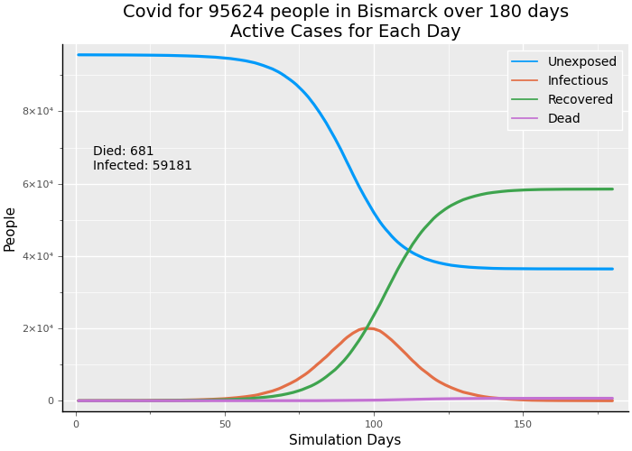


```julia
infection_outcome(series, bismarck.fips)
```


    (infect_pop = 0.6189943316112029, death_pct = 0.011505905012925135, death_pop = 0.007122089983057583)


```julia
str_50 = sd_gen(start=50, comply=.9, cf=(.5,1.2), tf=(.18,.42))
alldict, env, series = run_a_sim(180, bismarck.fips, showr0=false, silent=true,
    spreadcases=[str_50],
    runcases=[seed_1_6]);
```

    *** seed day 1 locale 38015....
    Simulation completed for 180 days.


# Moderately Strong Social Distancing starts on Day 50


```julia
bissd50=cumplot(series,bismarck.fips,geo=geo)
```


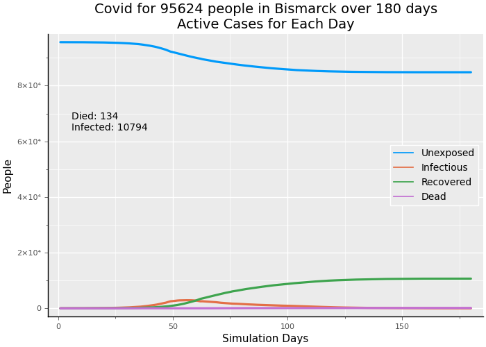


```julia
infection_outcome(series, bismarck.fips)
```


    (infect_pop = 0.11298081951097073, death_pct = 0.012403961862445616, death_pop = 0.0014014097764019327)


```julia
open = sd_gen(start=80, comply=0.7, cf=(.5,1.5), tf=(.25,.50))
```


    (::CovidSim.var"#sd_mod#123"{CovidSim.var"#sd_mod#122#124"{Int64,Float64,Tuple{Float64,Float64},Tuple{Float64,Float64}}}) (generic function with 1 method)


```julia
alldict, env, series = run_a_sim(180,bismarck.fips, showr0=false, silent=true,
    spreadcases=[str_50, open],
    runcases=[seed_1_6]);
```

    *** seed day 1 locale 38015....
    Simulation completed for 180 days.


# With low cases and deaths very low-->open up significantly, but not completely


```julia
bisopen=cumplot(series,bismarck.fips,geo=geo)
```


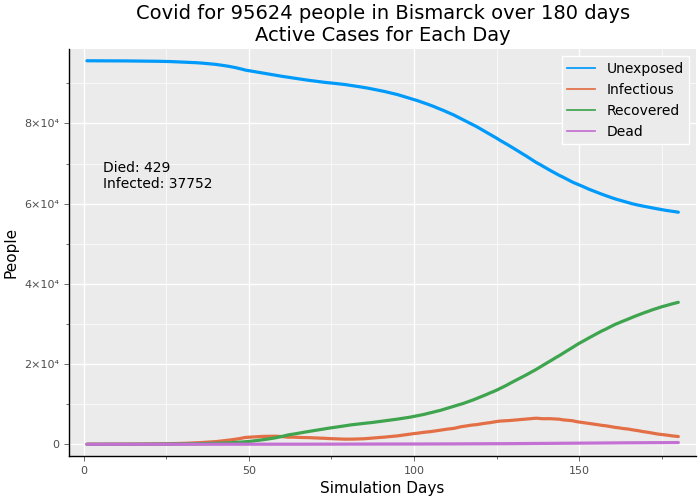


```julia
bisbump=cumplot(series,bismarck.fips,[infectious, dead],geo=geo)
```


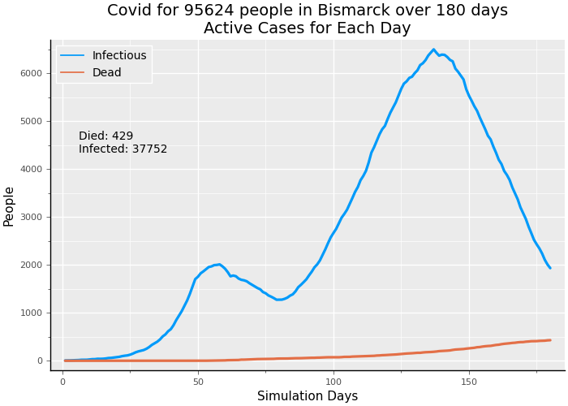


```julia
infection_outcome(series, bismarck.fips)
```


    (infect_pop = 0.4151101257085486, death_pct = 0.010808223319560616, death_pop = 0.004486602940868874)


# Adopt Test, Trace and Isolate


```julia
t_n_t100_160=CovidSim.t_n_t_case_gen(100,160,tc_perday=1000, test_delay=3,
    breakout_pct=0.2, q_comply=0.75,past_contacts=false)
```


    (::CovidSim.var"#scase#50"{CovidSim.var"#scase#49#51"{Int64,Float64,Float64,Float64,Float64,Float64,Float64,Float64,Int64,Int64,Int64,Bool,Bool,Int64,Int64}}) (generic function with 1 method)


```julia
alldict, env, series = run_a_sim(180, bismarck.fips, showr0=false, silent=true,
    spreadcases=[str_50, open],
    runcases=[seed_1_6, t_n_t100_160]);
```

    *** seed day 1 locale 38015....


    ┌ Warning: Attempt to isolate more people than were in the category: proceeding with available.
    └ @ CovidSim /Users/lewis/.julia-local-packages/Covid/src/transition.jl:249
    ┌ Warning: Attempt to isolate more people than were in the category: proceeding with available.
    └ @ CovidSim /Users/lewis/.julia-local-packages/Covid/src/transition.jl:249


    Simulation completed for 180 days.

# Apply Test, Trace and Isolate

- test capacity of 1% of population per day
- quarantine compliance of 75%
- delay of 3 days returning test results


```julia
cumplot(series,38015,geo=geo)
```


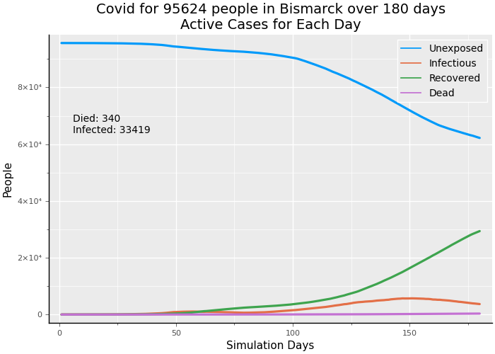


# Apply Test, Trace and Isolate--raising test capacity to 5% of population

- 4800 tests per day (roughly 5% of population)
- quarantine compliance of 95%
- test results returned same day


```julia
t_n_t100_160=CovidSim.t_n_t_case_gen(100,160,tc_perday=4800, test_delay=0,
    breakout_pct=0.20, q_comply=0.95, past_contacts=false)
```


    (::CovidSim.var"#scase#50"{CovidSim.var"#scase#49#51"{Int64,Float64,Float64,Float64,Float64,Float64,Float64,Float64,Int64,Int64,Int64,Bool,Bool,Int64,Int64}}) (generic function with 1 method)


```julia
alldict, env, series = run_a_sim(180,bismarck.fips, showr0=false, silent=true,
    spreadcases=[str_50, open],
    runcases=[seed_1_6, t_n_t100_160]);
```

    *** seed day 1 locale 38015....
    Simulation completed for 180 days.


```julia
cumplot(series,bismarck.fips,geo=geo)
```


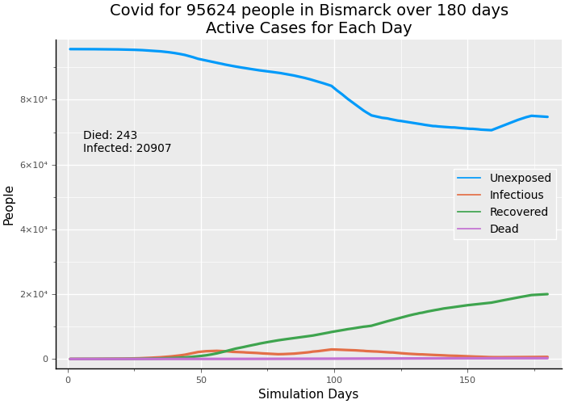


# Apply Test, Trace and Isolate
- testing capacity of 10% of the population
- quarantine compliance of 97%
- delay in obtaining test results of 0 days


```julia
t_n_t100_160=CovidSim.t_n_t_case_gen(100,160,tc_perday=10_000, test_delay=0,
    breakout_pct=0.20, q_comply=0.97,past_contacts=false)
```


    (::CovidSim.var"#scase#50"{CovidSim.var"#scase#49#51"{Int64,Float64,Float64,Float64,Float64,Float64,Float64,Float64,Int64,Int64,Int64,Bool,Bool,Int64,Int64}}) (generic function with 1 method)


```julia
alldict, env, series = run_a_sim(180, bismarck.fips, showr0=false, silent=true,
    spreadcases=[str_50, open],
    runcases=[seed_1_6, t_n_t100_160]);
```

    *** seed day 1 locale 38015....


    ┌ Warning: Attempt to isolate more people than were in the category: proceeding with available.
    └ @ CovidSim /Users/lewis/.julia-local-packages/Covid/src/transition.jl:249


    Simulation completed for 180 days.


```julia
cumplot(series,bismarck.fips,geo=geo)
```


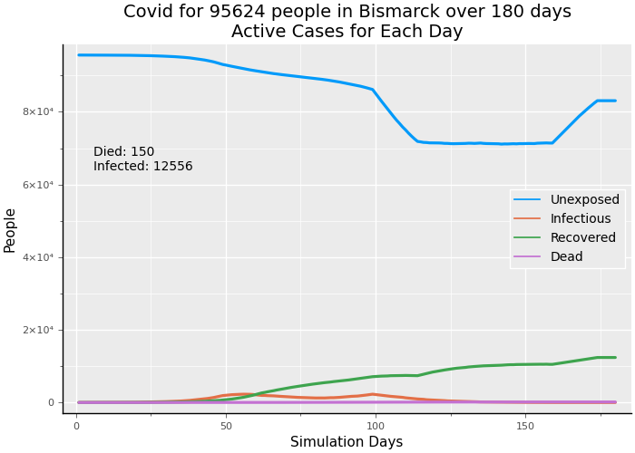


```julia

```


```julia

```

# Very large city: no social distancing


```julia
alldict, env, series = run_a_sim(180,newyork.fips, showr0=false, silent=true,
    spreadcases=[],
    runcases=[seed_1_6]);
```

    *** seed day 1 locale 36061....
    Simulation completed for 180 days.


```julia
nycfull=cumplot(series, newyork.fips, geo=geo)
```


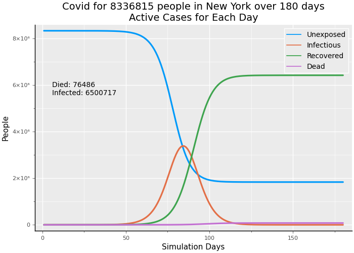


```julia
infection_outcome(series, newyork.fips)
```


    (infect_pop = 0.7797615370581238, death_pct = 0.011765768207628598, death_pop = 0.009174493502250082)


```julia
str_50 = sd_gen(start=50, comply=.9, cf=(.5,1.2), tf=(.18,.42))
alldict, env, series = run_a_sim(180, newyork.fips, showr0=false, silent=true,
    spreadcases=[str_50],
    runcases=[seed_1_6]);
```

    *** seed day 1 locale 36061....
    Simulation completed for 180 days.


# Moderately Strong Social Distancing starts on Day 50


```julia
nycsd50=cumplot(series,newyork.fips,geo=geo)
```


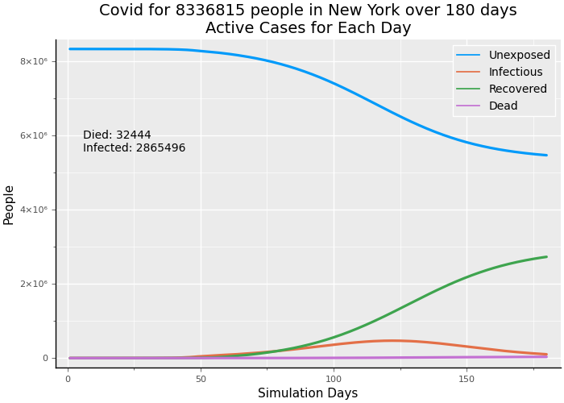


Note: The total of deaths is a bit higher than NYC deaths as of May 23 at 21086, which is day 122, while the simulation is run for almost another 2 months.


```julia
infection_outcome(series, newyork.fips)
```


    (infect_pop = 0.35600383791928064, death_pct = 0.01093150256609307, death_pop = 0.003891656867753597)


```julia
open = sd_gen(start=95, comply=0.7, cf=(.5,1.5), tf=(.25,.50))
```


    (::CovidSim.var"#sd_mod#123"{CovidSim.var"#sd_mod#122#124"{Int64,Float64,Tuple{Float64,Float64},Tuple{Float64,Float64}}}) (generic function with 1 method)


```julia
alldict, env, series = run_a_sim(180, newyork.fips, showr0=false, silent=true,
    spreadcases=[str_50, open],
    runcases=[seed_1_6]);
```

    *** seed day 1 locale 36061....
    Simulation completed for 180 days.


# With declining cases and declining deaths-->open up later on day 95


```julia
nycopen=cumplot(series,newyork.fips,geo=geo)
```


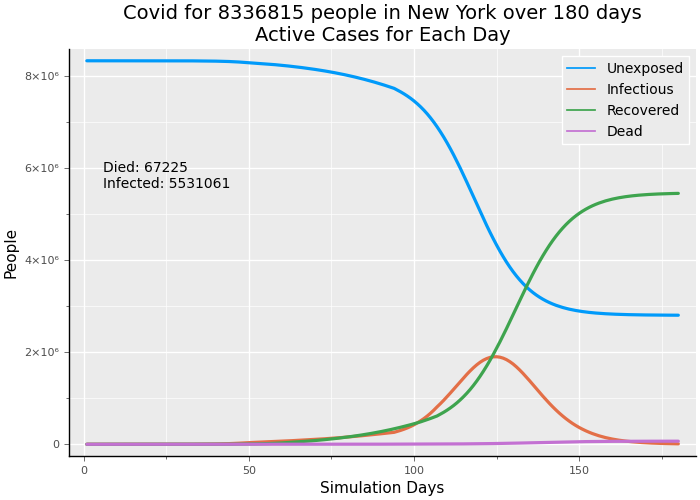


```julia
nycbump=cumplot(series, newyork.fips, [infectious, dead],geo=geo)
```


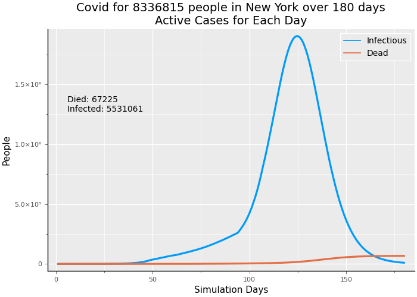


Note: We don't see a "double-dip" pattern for New York City because the original curve of infection had not turned as sharply down, but had moderated considerably. When opening occurs, the infection rate looks like unrestrained virus transmission.


```julia

```


```julia
t_n_t100_160=CovidSim.t_n_t_case_gen(100,160,tc_perday=80_000,breakout_pct=0.20, q_comply=0.75,past_contacts=false)
```


    (::CovidSim.var"#scase#50"{CovidSim.var"#scase#49#51"{Int64,Float64,Float64,Float64,Float64,Float64,Float64,Float64,Int64,Int64,Int64,Bool,Bool,Int64,Int64}}) (generic function with 1 method)


```julia
alldict, env, series = run_a_sim(180,newyork.fips, showr0=false, silent=true,
    spreadcases=[str_50, open],
    runcases=[seed_1_6, t_n_t100_160]);
```

    *** seed day 1 locale 36061....
    Simulation completed for 180 days.


# Apply Test, Trace and Isolate: 
- 80,000 tests per day 
- quarantine compliance of 75%
- delay in returning test results of 3 days


```julia
cumplot(series,newyork.fips,geo=geo)
```


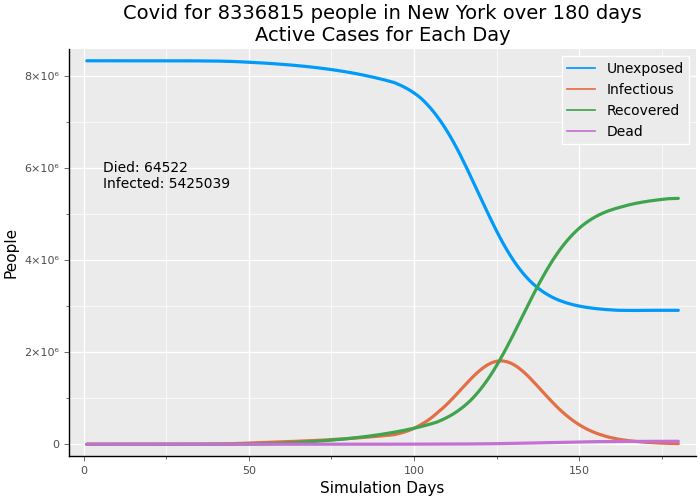


# Apply Test, Trace and Isolate 

- 835,000 tests per day (roughly 10% of population)
- quarantine compliance of 95%
- test results returned same day


```julia
t_n_t100_160=CovidSim.t_n_t_case_gen(100,160,tc_perday=835_000, test_delay=0,
    breakout_pct=0.20, q_comply=0.95, past_contacts=false)
```


    (::CovidSim.var"#scase#50"{CovidSim.var"#scase#49#51"{Int64,Float64,Float64,Float64,Float64,Float64,Float64,Float64,Int64,Int64,Int64,Bool,Bool,Int64,Int64}}) (generic function with 1 method)


```julia
alldict, env, series = run_a_sim(180,newyork.fips, showr0=false, silent=true,
    spreadcases=[str_50, open],
    runcases=[seed_1_6, t_n_t100_160]);
```

    *** seed day 1 locale 36061....
    Simulation completed for 180 days.


```julia
cumplot(series,newyork.fips,geo=geo)
```


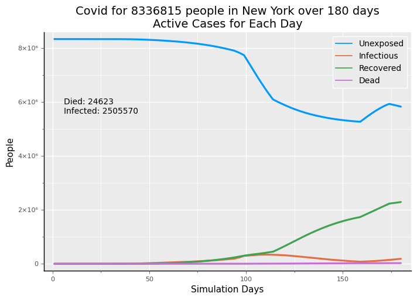


Note: returning tests results same day results in 25% reduction in deaths compared to a delay of 3 days. 

# Apply Test, Trace and Isolate--raising test capacity to 5% of population

- 420,000 tests per day (roughly 5% of population)
- quarantine compliance of 95%
- test results returned same day


```julia
t_n_t100_160=CovidSim.t_n_t_case_gen(100,160,tc_perday=420_000, test_delay=0,
    breakout_pct=0.20, q_comply=0.95, past_contacts=false)
```


    (::CovidSim.var"#scase#50"{CovidSim.var"#scase#49#51"{Int64,Float64,Float64,Float64,Float64,Float64,Float64,Float64,Int64,Int64,Int64,Bool,Bool,Int64,Int64}}) (generic function with 1 method)


```julia
alldict, env, series = run_a_sim(180,newyork.fips, showr0=false, silent=true,
    spreadcases=[str_50, open],
    runcases=[seed_1_6, t_n_t100_160]);
```

    *** seed day 1 locale 36061....
    Simulation completed for 180 days.


```julia
cumplot(series,newyork.fips,geo=geo)
```


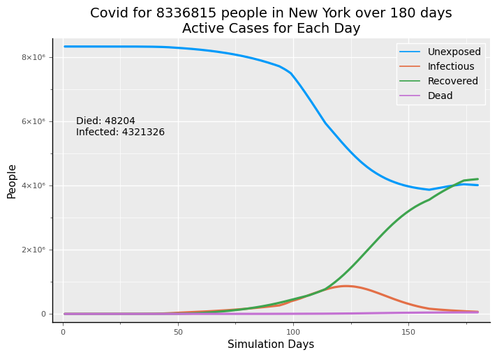


```julia

```
