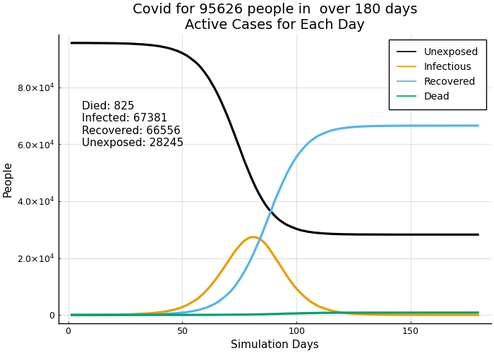
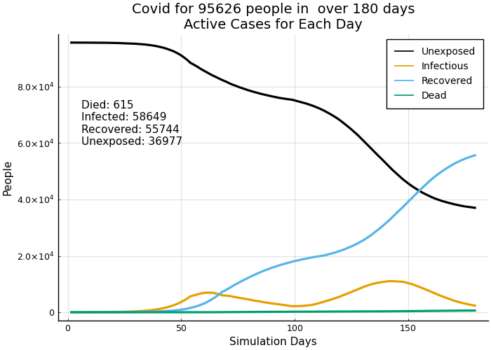
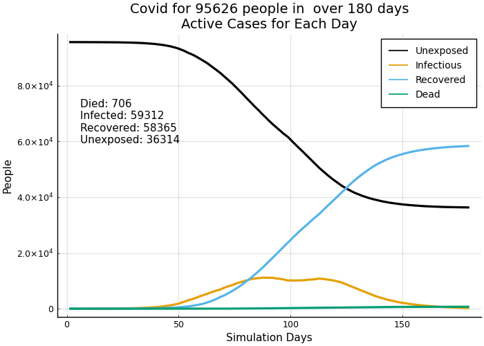
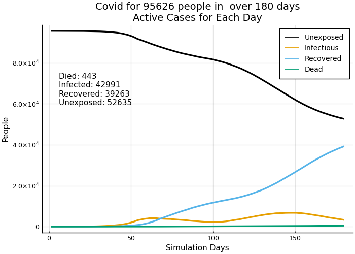
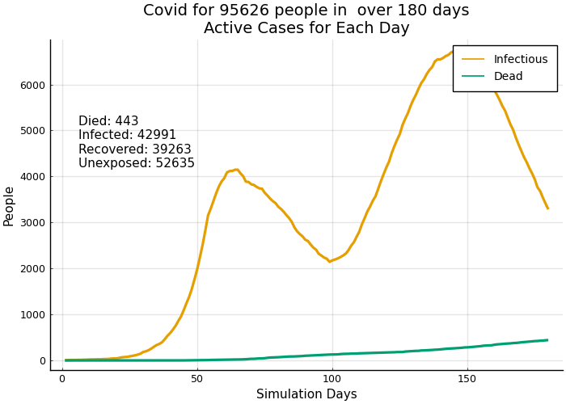

```julia
using CovidSim_ilm
```


```julia
using StatsBase
using TypedTables
using BenchmarkTools
using Distributions
```


```julia
cd(joinpath(homedir(),"Dropbox/Covid Modeling/Covid/ilm-src"))
```

# Test setup and population matrix


```julia
# set locale
locale = 38015
```


    38015


```julia
alldict = setup(150, [locale])
```


    Dict{String, Any} with 4 entries:
      "geo"     => 15×10 DataFrame…
      "sp"      => (contact_factors = Dict(5=>Dict("sick"=>0.6, "nil"=>1.0, "severe…
      "dat"     => Dict{String, Dict{Int64, V} where V}("agegrp_idx"=>Dict(38015=>D…
      "dt_dict" => Dict{String, Dict{Int64, V} where V}("sickdays"=>Dict(5=>[5, 9, …


```julia
alldict["dat"]
```


    Dict{String, Dict{Int64, V} where V} with 4 entries:
      "agegrp_idx" => Dict(38015=>Dict(5=>[91898, 91899, 91900, 91901, 91902, 91903…
      "newhistmx"  => Dict{Int64, Array{Int64, N} where N}(38015=>[0 0 … 0 0; 0 0 ……
      "popdat"     => Dict{Int64, Table{NamedTuple{(:status, :agegrp, :cond, :sickd…
      "cumhistmx"  => Dict{Int64, Array{Int64, N} where N}(38015=>[0 0 … 0 0; 0 0 ……


```julia
ilmat = alldict["dat"]["popdat"][locale]
```


    Table with 14 columns and 95626 rows:
          status  agegrp  cond  sickday  recov_day  dead_day  cluster  sdcomply  ⋯
        ┌───────────────────────────────────────────────────────────────────────────
     1  │ 1       1       0     0        0          0         0        none        ⋯
     2  │ 1       1       0     0        0          0         0        none        ⋯
     3  │ 1       1       0     0        0          0         0        none        ⋯
     4  │ 1       1       0     0        0          0         0        none        ⋯
     5  │ 1       1       0     0        0          0         0        none        ⋯
     6  │ 1       1       0     0        0          0         0        none        ⋯
     7  │ 1       1       0     0        0          0         0        none        ⋯
     8  │ 1       1       0     0        0          0         0        none        ⋯
     9  │ 1       1       0     0        0          0         0        none        ⋯
     10 │ 1       1       0     0        0          0         0        none        ⋯
     11 │ 1       1       0     0        0          0         0        none        ⋯
     12 │ 1       1       0     0        0          0         0        none        ⋯
     13 │ 1       1       0     0        0          0         0        none        ⋯
     14 │ 1       1       0     0        0          0         0        none        ⋯
     15 │ 1       1       0     0        0          0         0        none        ⋯
     16 │ 1       1       0     0        0          0         0        none        ⋯
     17 │ 1       1       0     0        0          0         0        none        ⋯
     18 │ 1       1       0     0        0          0         0        none        ⋯
     19 │ 1       1       0     0        0          0         0        none        ⋯
     20 │ 1       1       0     0        0          0         0        none        ⋯
     21 │ 1       1       0     0        0          0         0        none        ⋯
     22 │ 1       1       0     0        0          0         0        none        ⋯
     23 │ 1       1       0     0        0          0         0        none        ⋯
     ⋮  │   ⋮       ⋮      ⋮       ⋮         ⋮         ⋮         ⋮         ⋮       ⋱


```julia
ages = alldict["dat"]["agegrp_idx"][38015]
```


    Dict{Int64, Vector{Int64}} with 5 entries:
      5 => [91898, 91899, 91900, 91901, 91902, 91903, 91904, 91905, 91906, 91907  ……
      4 => [74303, 74304, 74305, 74306, 74307, 74308, 74309, 74310, 74311, 74312  ……
      2 => [24003, 24004, 24005, 24006, 24007, 24008, 24009, 24010, 24011, 24012  ……
      3 => [49918, 49919, 49920, 49921, 49922, 49923, 49924, 49925, 49926, 49927  ……
      1 => [1, 2, 3, 4, 5, 6, 7, 8, 9, 10  …  23993, 23994, 23995, 23996, 23997, 23…


```julia
columnnames(ilmat)
```


    (:status, :agegrp, :cond, :sickday, :recov_day, :dead_day, :cluster, :sdcomply, :vax, :vax_day, :test, :test_day, :quar, :quar_day)


```julia
countmap(ilmat.agegrp)
```


    Dict{Int64, Int64} with 5 entries:
      5 => 3729
      4 => 17595
      2 => 25915
      3 => 24385
      1 => 24002


```julia
sum(ilmat.status)  # everyone begins as unexposed
```


    95626


```julia
geodf = alldict["geo"]   # the date for all locales has been read into a dataframe
```


<table class="data-frame"><thead><tr><th></th><th>fips</th><th>county</th><th>city</th><th>state</th><th>sizecat</th><th>pop</th><th>density</th><th>density_factor</th></tr><tr><th></th><th>Int64</th><th>String</th><th>String</th><th>String</th><th>Int64</th><th>Int64</th><th>Int64</th><th>Float64</th></tr></thead><tbody><p>15 rows × 10 columns (omitted printing of 2 columns)</p><tr><th>1</th><td>6075</td><td>San Francisco</td><td>San Francisco</td><td>CA</td><td>2</td><td>881549</td><td>17255</td><td>1.04109</td></tr><tr><th>2</th><td>53033</td><td>Seattle</td><td>Seattle</td><td>WA</td><td>2</td><td>2252782</td><td>5175</td><td>0.931603</td></tr><tr><th>3</th><td>36061</td><td>New York</td><td>New York</td><td>NY</td><td>1</td><td>8336817</td><td>40306</td><td>1.25</td></tr><tr><th>4</th><td>39035</td><td>Cuyahoga</td><td>Cleveland</td><td>OH</td><td>2</td><td>1235072</td><td>3063</td><td>0.912462</td></tr><tr><th>5</th><td>48113</td><td>Dallas</td><td>Dallas</td><td>TX</td><td>2</td><td>2635516</td><td>4000</td><td>0.920954</td></tr><tr><th>6</th><td>39151</td><td>Stark</td><td>Canton</td><td>OH</td><td>3</td><td>370606</td><td>1688</td><td>0.9</td></tr><tr><th>7</th><td>34013</td><td>Essex</td><td>Newark</td><td>NJ</td><td>3</td><td>798975</td><td>6396</td><td>0.942669</td></tr><tr><th>8</th><td>13089</td><td>DeKalb</td><td>Atlanta</td><td>GA</td><td>2</td><td>1063937</td><td>2708</td><td>0.909244</td></tr><tr><th>9</th><td>17167</td><td>Sangamon</td><td>Springfield</td><td>IL</td><td>3</td><td>194672</td><td>1747</td><td>0.900535</td></tr><tr><th>10</th><td>38015</td><td>Burleigh</td><td>Bismarck</td><td>ND</td><td>3</td><td>95626</td><td>2157</td><td>0.904251</td></tr><tr><th>11</th><td>4013</td><td>Maricopa</td><td>Phoenix</td><td>AZ</td><td>1</td><td>4485414</td><td>2798</td><td>0.91006</td></tr><tr><th>12</th><td>42003</td><td>Allegheny</td><td>Pittsburgh</td><td>PA</td><td>2</td><td>1216045</td><td>5461</td><td>0.934195</td></tr><tr><th>13</th><td>27053</td><td>Hennepin</td><td>Minneapolis</td><td>MN</td><td>2</td><td>1265843</td><td>7821</td><td>0.955584</td></tr><tr><th>14</th><td>31055</td><td>Douglas</td><td>Omaha</td><td>NE</td><td>2</td><td>571327</td><td>3378</td><td>0.915317</td></tr><tr><th>15</th><td>8031</td><td>Denver</td><td>Denver</td><td>CO</td><td>2</td><td>727211</td><td>4520</td><td>0.925667</td></tr></tbody></table>


```julia
density_factor = geodf[geodf[!, :fips] .== locale, :density_factor][]
```


    0.9042506085245222


```julia
spreadparams = alldict["sp"];  # the spread parameters are loaded as a dict of float arrays
```


```julia
keys(spreadparams)
```


    (:contact_factors, :touch_factors, :shape, :riskmx)


```julia
contact_factors = spreadparams.contact_factors
```


    Dict{Int64, Dict{String, Float64}} with 5 entries:
      5 => Dict("sick"=>0.6, "nil"=>1.0, "severe"=>0.5, "mild"=>0.9)
      4 => Dict("sick"=>0.7, "nil"=>1.7, "severe"=>0.5, "mild"=>1.6)
      2 => Dict("sick"=>1.0, "nil"=>2.1, "severe"=>0.6, "mild"=>2.0)
      3 => Dict("sick"=>1.0, "nil"=>2.1, "severe"=>0.6, "mild"=>2.0)
      1 => Dict("sick"=>0.7, "nil"=>1.1, "severe"=>0.5, "mild"=>1.1)


```julia
contact_factors[5]
```


    Dict{String, Float64} with 4 entries:
      "sick"   => 0.6
      "nil"    => 1.0
      "severe" => 0.5
      "mild"   => 0.9


```julia
touch_factors =  spreadparams.touch_factors
```


    Dict{Int64, Dict{String, Float64}} with 5 entries:
      5 => Dict("sick"=>0.18, "unexposed"=>0.35, "nil"=>0.35, "severe"=>0.18, "reco…
      4 => Dict("sick"=>0.18, "unexposed"=>0.41, "nil"=>0.41, "severe"=>0.18, "reco…
      2 => Dict("sick"=>0.35, "unexposed"=>0.63, "nil"=>0.63, "severe"=>0.18, "reco…
      3 => Dict("sick"=>0.3, "unexposed"=>0.61, "nil"=>0.61, "severe"=>0.18, "recov…
      1 => Dict("sick"=>0.28, "unexposed"=>0.55, "nil"=>0.55, "severe"=>0.18, "reco…


```julia
touch_factors[1]
```


    Dict{String, Float64} with 6 entries:
      "sick"      => 0.28
      "unexposed" => 0.55
      "nil"       => 0.55
      "severe"    => 0.18
      "recovered" => 0.55
      "mild"      => 0.55


```julia
dectree = alldict["dt_dict"]["dt"] # the decision trees for all age groups are loaded
```


    Dict{Int64, OrderedCollections.OrderedDict{Any, Any}} with 5 entries:
      5 => OrderedCollections.OrderedDict(25=>Dict{Any, Any}(7=>Dict{String, Vector…
      4 => OrderedCollections.OrderedDict(25=>Dict{Any, Any}(7=>Dict{String, Vector…
      2 => OrderedCollections.OrderedDict(25=>Dict{Any, Any}(7=>Dict{String, Vector…
      3 => OrderedCollections.OrderedDict(25=>Dict{Any, Any}(7=>Dict{String, Vector…
      1 => OrderedCollections.OrderedDict(25=>Dict{Any, Any}(7=>Dict{String, Vector…


```julia
typeof(dectree)
```


    Dict{Int64, OrderedCollections.OrderedDict{Any, Any}}


Dict{Int64, OrderedCollections.OrderedDict{Int, Dict{String, Vector{T} where T}


```julia
dectree[5][25]
```


    Dict{Any, Any} with 2 entries:
      7 => Dict{String, Vector{T} where T}("probs"=>[0.682, 0.318], "outcomes"=>[3,…
      8 => Dict{String, Vector{T} where T}("probs"=>[0.676, 0.324], "outcomes"=>[3,…


```julia
typeof(dectree[5][25][7]["outcomes"])
```


    Vector{Int64} (alias for Array{Int64, 1})


```julia
function get_node(dectree, agegrp, sickday, fromcond)
    dectree[agegrp][sickday][fromcond]
end
```


    get_node (generic function with 1 method)


```julia
@time node = get_node(dectree, 5, 25, 7)
```

      0.009440 seconds (1.89 k allocations: 105.929 KiB, 99.71% compilation time)


    Dict{String, Vector{T} where T} with 2 entries:
      "probs"    => [0.682, 0.318]
      "outcomes" => [3, 4]


```julia
@btime get_node(dectree, 5, 25, 7)["probs"]
```

      115.092 ns (0 allocations: 0 bytes)


    2-element Vector{Float64}:
     0.682
     0.318


# Create a seed case


```julia
seed_1_6 = seed_case_gen(1, [0,3,3,0,0], 1, nil, agegrps)
```


    (::CovidSim_ilm.var"#scase#62"{Int64, Vector{Int64}, Int64, Int64, Vector{Int64}}) (generic function with 1 method)


# Run a simulation


```julia
result_dict, series = run_a_sim(180, locale, showr0=false, silent=true, runcases=[seed_1_6]);
```

    *** seed day 1: 6 5 to 38015
    (idxtime, sprtime, trtime, histtime) = (0.09851410500000003, 0.3592263429999999, 0.09706848700000004, 0.1294554820000001)


```julia
result_dict
```


    Dict{String, Any} with 4 entries:
      "geo"     => 15×10 DataFrame…
      "sp"      => (contact_factors = Dict(5=>Dict("sick"=>0.6, "nil"=>1.0, "severe…
      "dat"     => Dict{String, Dict{Int64, V} where V}("agegrp_idx"=>Dict(38015=>D…
      "dt_dict" => Dict{String, Dict{Int64, V} where V}("sickdays"=>Dict(5=>[5, 9, …


```julia
popdat = result_dict["dat"]["popdat"][locale]
```


    Table with 14 columns and 95626 rows:
          status  agegrp  cond  sickday  recov_day  dead_day  cluster  sdcomply  ⋯
        ┌───────────────────────────────────────────────────────────────────────────
     1  │ 3       1       0     9        68         0         0        none        ⋯
     2  │ 3       1       0     14       99         0         0        none        ⋯
     3  │ 1       1       0     0        0          0         0        none        ⋯
     4  │ 1       1       0     0        0          0         0        none        ⋯
     5  │ 1       1       0     0        0          0         0        none        ⋯
     6  │ 1       1       0     0        0          0         0        none        ⋯
     7  │ 1       1       0     0        0          0         0        none        ⋯
     8  │ 3       1       0     14       98         0         0        none        ⋯
     9  │ 1       1       0     0        0          0         0        none        ⋯
     10 │ 3       1       0     14       91         0         0        none        ⋯
     11 │ 1       1       0     0        0          0         0        none        ⋯
     12 │ 1       1       0     0        0          0         0        none        ⋯
     13 │ 3       1       0     9        98         0         0        none        ⋯
     14 │ 3       1       0     9        101        0         0        none        ⋯
     15 │ 1       1       0     0        0          0         0        none        ⋯
     16 │ 3       1       0     9        86         0         0        none        ⋯
     17 │ 3       1       0     14       100        0         0        none        ⋯
     18 │ 1       1       0     0        0          0         0        none        ⋯
     19 │ 1       1       0     0        0          0         0        none        ⋯
     20 │ 1       1       0     0        0          0         0        none        ⋯
     21 │ 1       1       0     0        0          0         0        none        ⋯
     22 │ 3       1       0     14       91         0         0        none        ⋯
     23 │ 1       1       0     0        0          0         0        none        ⋯
     ⋮  │   ⋮       ⋮      ⋮       ⋮         ⋮         ⋮         ⋮         ⋮       ⋱


```julia
countmap(popdat.cond)
```


    Dict{Int64, Int64} with 1 entry:
      0 => 95626


```julia
countmap(popdat.status)
```


    Dict{Int64, Int64} with 3 entries:
      4 => 825
      3 => 66556
      1 => 28245


```julia
virus_outcome(series, locale)
```


    Dict{String, Float64} with 4 entries:
      "unexposed"  => 0.419221
      "infectious" => 0.0
      "dead"       => 0.0122449
      "recovered"  => 0.987844


# Plotted results


```julia
cumplot(series, locale)
```


    

    


Note that the orangle line labeled Infectious that shows the number of infected people is *not* what you see in newspaper accounts. In this plot Infectious shows the net infected people: Some people got sick today. Some people get better: they're not infectious any more--they recovered and are on the blue line. Sadly, some people died--they're not infectious either--they're dead and are on the green line. Newspaper tracking shows the new active infections of each day--who got sick today? The next day, if no one new got sick the line would be at zero--even though the people who got sick aren't better yet. So, the newspaper line goes up and down faster. Yet another approach is to show the cumulative number of infected people: This keeps going up until no one new gets infected--then the line is high but levels off. This is the least common way to show the data.

## Test a social distancing case


```julia
sd1 = sd_gen(startday = 55, comply=0.9, cf=(.2,1.0), tf=(.18,.6), name=:mod_80, agegrps=[])    
```


    (::CovidSim_ilm.var"#scase#87"{Int64, Float64, Tuple{Float64, Float64}, Tuple{Float64, Float64}, Symbol, Vector{Any}}) (generic function with 1 method)


```julia
sd1_end = sd_gen(startday = 100, comply=0.0, cf=(.2,1.5), tf=(.18,.6), name=:mod_80, agegrps=[])
```


    (::CovidSim_ilm.var"#scase#87"{Int64, Float64, Tuple{Float64, Float64}, Tuple{Float64, Float64}, Symbol, Vector{Any}}) (generic function with 1 method)


```julia
result_dict, series = run_a_sim(180, locale, showr0=false, silent=true, runcases=[seed_1_6, sd1, sd1_end]);
```

    *** seed day 1: 6 5 to 38015
    (idxtime, sprtime, trtime, histtime) = (0.09293880900000002, 0.35394693200000005, 0.10381670700000002, 0.142302056)


```julia
virus_outcome(series, locale)
```


    Dict{String, Float64} with 4 entries:
      "unexposed"  => 0.630544
      "infectious" => 0.0390498
      "dead"       => 0.0104872
      "recovered"  => 0.950565


```julia
cumplot(series, locale)
```


    

    


```julia
outdat = result_dict["dat"]["popdat"][locale]
```


    Table with 14 columns and 95626 rows:
          status  agegrp  cond  sickday  recov_day  dead_day  cluster  sdcomply  ⋯
        ┌───────────────────────────────────────────────────────────────────────────
     1  │ 1       1       0     0        0          0         0        none        ⋯
     2  │ 1       1       0     0        0          0         0        none        ⋯
     3  │ 3       1       0     9        131        0         0        none        ⋯
     4  │ 1       1       0     0        0          0         0        none        ⋯
     5  │ 1       1       0     0        0          0         0        none        ⋯
     6  │ 3       1       0     9        77         0         0        none        ⋯
     7  │ 1       1       0     0        0          0         0        none        ⋯
     8  │ 1       1       0     0        0          0         0        none        ⋯
     9  │ 1       1       0     0        0          0         0        none        ⋯
     10 │ 1       1       0     0        0          0         0        none        ⋯
     11 │ 1       1       0     0        0          0         0        none        ⋯
     12 │ 2       1       6     13       0          0         0        none        ⋯
     13 │ 1       1       0     0        0          0         0        none        ⋯
     14 │ 1       1       0     0        0          0         0        none        ⋯
     15 │ 1       1       0     0        0          0         0        none        ⋯
     16 │ 1       1       0     0        0          0         0        none        ⋯
     17 │ 3       1       0     9        136        0         0        none        ⋯
     18 │ 1       1       0     0        0          0         0        none        ⋯
     19 │ 1       1       0     0        0          0         0        none        ⋯
     20 │ 3       1       0     14       153        0         0        none        ⋯
     21 │ 1       1       0     0        0          0         0        none        ⋯
     22 │ 3       1       0     14       160        0         0        none        ⋯
     23 │ 1       1       0     0        0          0         0        none        ⋯
     ⋮  │   ⋮       ⋮      ⋮       ⋮         ⋮         ⋮         ⋮         ⋮       ⋱


## Social distancing only among those age40_59, age60_79, age80_plus


```julia
sdolder = sd_gen(startday = 55, comply=0.9, cf=(.2,1.0), tf=(.18,.6), name=:mod_80, 
    agegrps=[age40_59, age60_79, age80_up])    
```


    (::CovidSim_ilm.var"#scase#87"{Int64, Float64, Tuple{Float64, Float64}, Tuple{Float64, Float64}, Symbol, Vector{Int64}}) (generic function with 1 method)


```julia
sdolder_end = sd_gen(startday = 100, comply=0.0, cf=(.2,1.5), tf=(.18,.6), name=:mod_80, 
    agegrps=[age40_59, age60_79, age80_up])    
```


    (::CovidSim_ilm.var"#scase#87"{Int64, Float64, Tuple{Float64, Float64}, Tuple{Float64, Float64}, Symbol, Vector{Int64}}) (generic function with 1 method)


```julia
result_dict, series = run_a_sim(180, locale, showr0=false, silent=true, 
    runcases=[seed_1_6, sdolder, sdolder_end]);
```

    *** seed day 1: 6 5 to 38015
    (idxtime, sprtime, trtime, histtime) = (0.10227734400000002, 0.3089306639999999, 0.089460271, 0.13305203000000002)


```julia
cumplot(series, locale)
```


    

    


## Social Distancing starts with everyone and then the younger folks party


```julia
sdyoung_end = sd_gen(startday = 100, comply=0.0, cf=(.2,1.5), tf=(.18,.6), name=:mod_80, 
    agegrps=[age0_19, age20_39])    
```


    (::CovidSim_ilm.var"#scase#87"{Int64, Float64, Tuple{Float64, Float64}, Tuple{Float64, Float64}, Symbol, Vector{Int64}}) (generic function with 1 method)


```julia
result_dict, series = run_a_sim(180, locale, showr0=false, silent=true, 
    runcases=[seed_1_6, sd1, sdolder_end]);
```

    *** seed day 1: 6 5 to 38015
    (idxtime, sprtime, trtime, histtime) = (0.11268328900000003, 0.2632891130000001, 0.07112639200000001, 0.14569826500000002)


```julia
cumplot(series, locale)
```


    

    


```julia
cumplot(series, locale, [infectious, dead])
```


    

    


```julia

```

### Ways to reduce allocations for indexing


```julia
a = rand(1000); b = rand(["this", "is", "it"], 1000); c = rand(1:7,1000); i = 1:1000;
t = Table(a=a, b=b, c=c, i=i)
```


    Table with 4 columns and 1000 rows:
          a          b     c  i
        ┌───────────────────────
     1  │ 0.34085    this  4  1
     2  │ 0.194814   is    4  2
     3  │ 0.052135   it    3  3
     4  │ 0.732344   is    6  4
     5  │ 0.32407    is    7  5
     6  │ 0.47075    this  7  6
     7  │ 0.62095    is    6  7
     8  │ 0.935693   this  6  8
     9  │ 0.704595   this  2  9
     10 │ 0.923636   this  7  10
     11 │ 0.296329   is    4  11
     12 │ 0.0990286  this  3  12
     13 │ 0.506774   it    3  13
     14 │ 0.538393   this  1  14
     15 │ 0.936048   is    3  15
     16 │ 0.36022    it    2  16
     17 │ 0.863339   is    2  17
     18 │ 0.272699   is    4  18
     19 │ 0.661308   this  7  19
     20 │ 0.656952   is    3  20
     21 │ 0.433936   is    4  21
     22 │ 0.525972   it    2  22
     23 │ 0.664367   this  6  23
     ⋮  │     ⋮       ⋮    ⋮  ⋮


```julia
function optfindall(p, X, maxlen=0)
    if maxlen==0
        out = Vector{Int}(undef, length(X))
    elseif isa(maxlen, Int)
        out = Vector{Int}(undef, maxlen)
    else
        out = Vector{Int}(undef, floor(Int, maxlen * length(X)))
    end
    ind = 0
    @inbounds for (i, x) in pairs(X)
        if p(x)
            out[ind+=1] = i
        end
    end
    resize!(out, ind)
    return out
end
```


    optfindall (generic function with 2 methods)


```julia
floor(Int,.23  * length(t))
```


    230


```julia
@time optfindall(==(6),t.c,.2);
```

      0.022799 seconds (18.24 k allocations: 1.041 MiB, 99.76% compilation time)


```julia
@time findall(t.c .== 6)
```

      0.000027 seconds (7 allocations: 5.750 KiB)


    142-element Vector{Int64}:
       4
       7
       8
      23
      25
      30
      36
      39
      41
      52
      59
      62
      63
       ⋮
     928
     933
     934
     936
     957
     963
     971
     977
     979
     981
     983
     992


```julia
for k in eachindex(t.c .== 3)
    println(k, " ", t.i[k])
end
```

    1 1
    2 2
    3 3
    4 4
    5 5
    6 6
    7 7
    8 8
    9 9
    10 10
    11 11
    12 12
    13 13
    14 14
    15 15
    16 16
    17 17
    18 18
    19 19
    20 20
    21 21
    22 22
    23 23
    24 24
    25 25
    26 26
    27 27
    28 28
    29 29
    30 30
    31 31
    32 32
    33 33
    34 34
    35 35
    36 36
    37 37
    38 38
    39 39
    40 40
    41 41
    42 42
    43 43
    44 44
    45 45
    46 46
    47 47
    48 48
    49 49
    50 50
    51 51
    52 52
    53 53
    54 54
    55 55
    56 56
    57 57
    58 58
    59 59
    60 60
    61 61
    62 62
    63 63
    64 64
    65 65
    66 66
    67 67
    68 68
    69 69
    70 70
    71 71
    72 72
    73 73
    74 74
    75 75
    76 76
    77 77
    78 78
    79 79
    80 80
    81 81
    82 82
    83 83
    84 84
    85 85
    86 86
    87 87
    88 88
    89 89
    90 90
    91 91
    92 92
    93 93
    94 94
    95 95
    96 96
    97 97
    98 98
    99 99
    100 100
    101 101
    102 102
    103 103
    104 104
    105 105
    106 106
    107 107
    108 108
    109 109
    110 110
    111 111
    112 112
    113 113
    114 114
    115 115
    116 116
    117 117
    118 118
    119 119
    120 120
    121 121
    122 122
    123 123
    124 124
    125 125
    126 126
    127 127
    128 128
    129 129
    130 130
    131 131
    132 132
    133 133
    134 134
    135 135
    136 136
    137 137
    138 138
    139 139
    140 140
    141 141
    142 142
    143 143
    144 144
    145 145
    146 146
    147 147
    148 148
    149 149
    150 150
    151 151
    152 152
    153 153
    154 154
    155 155
    156 156
    157 157
    158 158
    159 159
    160 160
    161 161
    162 162
    163 163
    164 164
    165 165
    166 166
    167 167
    168 168
    169 169
    170 170
    171 171
    172 172
    173 173
    174 174
    175 175
    176 176
    177 177
    178 178
    179 179
    180 180
    181 181
    182 182
    183 183
    184 184
    185 185
    186 186
    187 187
    188 188
    189 189
    190 190
    191 191
    192 192
    193 193
    194 194
    195 195
    196 196
    197 197
    198 198
    199 199
    200 200
    201 201
    202 202
    203 203
    204 204
    205 205
    206 206
    207 207
    208 208
    209 209
    210 210
    211 211
    212 212
    213 213
    214 214
    215 215
    216 216
    217 217
    218 218
    219 219
    220 220
    221 221
    222 222
    223 223
    224 224
    225 225
    226 226
    227 227
    228 228
    229 229
    230 230
    231 231
    232 232
    233 233
    234 234
    235 235
    236 236
    237 237
    238 238
    239 239
    240 240
    241 241
    242 242
    243 243
    244 244
    245 245
    246 246
    247 247
    248 248
    249 249
    250 250
    251 251
    252 252
    253 253
    254 254
    255 255
    256 256
    257 257
    258 258
    259 259
    260 260
    261 261
    262 262
    263 263
    264 264
    265 265
    266 266
    267 267
    268 268
    269 269
    270 270
    271 271
    272 272
    273 273
    274 274
    275 275
    276 276
    277 277
    278 278
    279 279
    280 280
    281 281
    282 282
    283 283
    284 284
    285 285
    286 286
    287 287
    288 288
    289 289
    290 290
    291 291
    292 292
    293 293
    294 294
    295 295
    296 296
    297 297
    298 298
    299 299
    300 300
    301 301
    302 302
    303 303
    304 304
    305 305
    306 306
    307 307
    308 308
    309 309
    310 310
    311 311
    312 312
    313 313
    314 314
    315 315
    316 316
    317 317
    318 318
    319 319
    320 320
    321 321
    322 322
    323 323
    324 324
    325 325
    326 326
    327 327
    328 328
    329 329
    330 330
    331 331
    332 332
    333 333
    334 334
    335 335
    336 336
    337 337
    338 338
    339 339
    340 340
    341 341
    342 342
    343 343
    344 344
    345 345
    346 346
    347 347
    348 348
    349 349
    350 350
    351 351
    352 352
    353 353
    354 354
    355 355
    356 356
    357 357
    358 358
    359 359
    360 360
    361 361
    362 362
    363 363
    364 364
    365 365
    366 366
    367 367
    368 368
    369 369
    370 370
    371 371
    372 372
    373 373
    374 374
    375 375
    376 376
    377 377
    378 378
    379 379
    380 380
    381 381
    382 382
    383 383
    384 384
    385 385
    386 386
    387 387
    388 388
    389 389
    390 390
    391 391
    392 392
    393 393
    394 394
    395 395
    396 396
    397 397
    398 398
    399 399
    400 400
    401 401
    402 402
    403 403
    404 404
    405 405
    406 406
    407 407
    408 408
    409 409
    410 410
    411 411
    412 412
    413 413
    414 414
    415 415
    416 416
    417 417
    418 418
    419 419
    420 420
    421 421
    422 422
    423 423
    424 424
    425 425
    426 426
    427 427
    428 428
    429 429
    430 430
    431 431
    432 432
    433 433
    434 434
    435 435
    436 436
    437 437
    438 438
    439 439
    440 440
    441 441
    442 442
    443 443
    444 444
    445 445
    446 446
    447 447
    448 448
    449 449
    450 450
    451 451
    452 452
    453 453
    454 454
    455 455
    456 456
    457 457
    458 458
    459 459
    460 460
    461 461
    462 462
    463 463
    464 464
    465 465
    466 466
    467 467
    468 468
    469 469
    470 470
    471 471
    472 472
    473 473
    474 474
    475 475
    476 476
    477 477
    478 478
    479 479
    480 480
    481 481
    482 482
    483 483
    484 484
    485 485
    486 486
    487 487
    488 488
    489 489
    490 490
    491 491
    492 492
    493 493
    494 494
    495 495
    496 496
    497 497
    498 498
    499 499
    500 500
    501 501
    502 502
    503 503
    504 504
    505 505
    506 506
    507 507
    508 508
    509 509
    510 510
    511 511
    512 512
    513 513
    514 514
    515 515
    516 516
    517 517
    518 518
    519 519
    520 520
    521 521
    522 522
    523 523
    524 524
    525 525
    526 526
    527 527
    528 528
    529 529
    530 530
    531 531
    532 532
    533 533
    534 534
    535 535
    536 536
    537 537
    538 538
    539 539
    540 540
    541 541
    542 542
    543 543
    544 544
    545 545
    546 546
    547 547
    548 548
    549 549
    550 550
    551 551
    552 552
    553 553
    554 554
    555 555
    556 556
    557 557
    558 558
    559 559
    560 560
    561 561
    562 562
    563 563
    564 564
    565 565
    566 566
    567 567
    568 568
    569 569
    570 570
    571 571
    572 572
    573 573
    574 574
    575 575
    576 576
    577 577
    578 578
    579 579
    580 580
    581 581
    582 582
    583 583
    584 584
    585 585
    586 586
    587 587
    588 588
    589 589
    590 590
    591 591
    592 592
    593 593
    594 594
    595 595
    596 596
    597 597
    598 598
    599 599
    600 600
    601 601
    602 602
    603 603
    604 604
    605 605
    606 606
    607 607
    608 608
    609 609
    610 610
    611 611
    612 612
    613 613
    614 614
    615 615
    616 616
    617 617
    618 618
    619 619
    620 620
    621 621
    622 622
    623 623
    624 624
    625 625
    626 626
    627 627
    628 628
    629 629
    630 630
    631 631
    632 632
    633 633
    634 634
    635 635
    636 636
    637 637
    638 638
    639 639
    640 640
    641 641
    642 642
    643 643
    644 644
    645 645
    646 646
    647 647
    648 648
    649 649
    650 650
    651 651
    652 652
    653 653
    654 654
    655 655
    656 656
    657 657
    658 658
    659 659
    660 660
    661 661
    662 662
    663 663
    664 664
    665 665
    666 666
    667 667
    668 668
    669 669
    670 670
    671 671
    672 672
    673 673
    674 674
    675 675
    676 676
    677 677
    678 678
    679 679
    680 680
    681 681
    682 682
    683 683
    684 684
    685 685
    686 686
    687 687
    688 688
    689 689
    690 690
    691 691
    692 692
    693 693
    694 694
    695 695
    696 696
    697 697
    698 698
    699 699
    700 700
    701 701
    702 702
    703 703
    704 704
    705 705
    706 706
    707 707
    708 708
    709 709
    710 710
    711 711
    712 712
    713 713
    714 714
    715 715
    716 716
    717 717
    718 718
    719 719
    720 720
    721 721
    722 722
    723 723
    724 724
    725 725
    726 726
    727 727
    728 728
    729 729
    730 730
    731 731
    732 732
    733 733
    734 734
    735 735
    736 736
    737 737
    738 738
    739 739
    740 740
    741 741
    742 742
    743 743
    744 744
    745 745
    746 746
    747 747
    748 748
    749 749
    750 750
    751 751
    752 752
    753 753
    754 754
    755 755
    756 756
    757 757
    758 758
    759 759
    760 760
    761 761
    762 762
    763 763
    764 764
    765 765
    766 766
    767 767
    768 768
    769 769
    770 770
    771 771
    772 772
    773 773
    774 774
    775 775
    776 776
    777 777
    778 778
    779 779
    780 780
    781 781
    782 782
    783 783
    784 784
    785 785
    786 786
    787 787
    788 788
    789 789
    790 790
    791 791
    792 792
    793 793
    794 794
    795 795
    796 796
    797 797
    798 798
    799 799
    800 800
    801 801
    802 802
    803 803
    804 804
    805 805
    806 806
    807 807
    808 808
    809 809
    810 810
    811 811
    812 812
    813 813
    814 814
    815 815
    816 816
    817 817
    818 818
    819 819
    820 820
    821 821
    822 822
    823 823
    824 824
    825 825
    826 826
    827 827
    828 828
    829 829
    830 830
    831 831
    832 832
    833 833
    834 834
    835 835
    836 836
    837 837
    838 838
    839 839
    840 840
    841 841
    842 842
    843 843
    844 844
    845 845
    846 846
    847 847
    848 848
    849 849
    850 850
    851 851
    852 852
    853 853
    854 854
    855 855
    856 856
    857 857
    858 858
    859 859
    860 860
    861 861
    862 862
    863 863
    864 864
    865 865
    866 866
    867 867
    868 868
    869 869
    870 870
    871 871
    872 872
    873 873
    874 874
    875 875
    876 876
    877 877
    878 878
    879 879
    880 880
    881 881
    882 882
    883 883
    884 884
    885 885
    886 886
    887 887
    888 888
    889 889
    890 890
    891 891
    892 892
    893 893
    894 894
    895 895
    896 896
    897 897
    898 898
    899 899
    900 900
    901 901
    902 902
    903 903
    904 904
    905 905
    906 906
    907 907
    908 908
    909 909
    910 910
    911 911
    912 912
    913 913
    914 914
    915 915
    916 916
    917 917
    918 918
    919 919
    920 920
    921 921
    922 922
    923 923
    924 924
    925 925
    926 926
    927 927
    928 928
    929 929
    930 930
    931 931
    932 932
    933 933
    934 934
    935 935
    936 936
    937 937
    938 938
    939 939
    940 940
    941 941
    942 942
    943 943
    944 944
    945 945
    946 946
    947 947
    948 948
    949 949
    950 950
    951 951
    952 952
    953 953
    954 954
    955 955
    956 956
    957 957
    958 958
    959 959
    960 960
    961 961
    962 962
    963 963
    964 964
    965 965
    966 966
    967 967
    968 968
    969 969
    970 970
    971 971
    972 972
    973 973
    974 974
    975 975
    976 976
    977 977
    978 978
    979 979
    980 980
    981 981
    982 982
    983 983
    984 984
    985 985
    986 986
    987 987
    988 988
    989 989
    990 990
    991 991
    992 992
    993 993
    994 994
    995 995
    996 996
    997 997
    998 998
    999 999
    1000 1000

